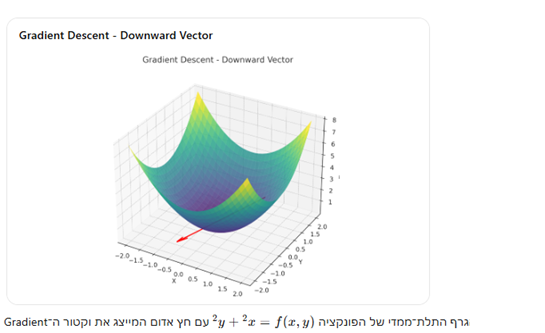

# גרדיאנט (Gradient)

גרדיאנט הוא מושג מתמטי המייצג את כיוון העלייה המרבית של פונקציה. במילים פשוטות, הגרדיאנט הוא וקטור המצביע לכיוון שבו הפונקציה גדלה בקצב המהיר ביותר.

## הגרדיאנט במקרה חד-ממדי (פונקציה של משתנה אחד)

לפני שנעבור למקרה הכללי, נבין את המושג עבור פונקציה של משתנה אחד $f(x)$.

במקרה חד-ממדי, הגרדיאנט הוא פשוט הנגזרת של הפונקציה:

$$\nabla f(x) = f'(x) = \frac{df}{dx}$$

הנגזרת בנקודה מסוימת מייצגת את שיפוע הפונקציה בנקודה זו:
- אם $f'(x) > 0$, הפונקציה עולה בנקודה $x$
- אם $f'(x) < 0$, הפונקציה יורדת בנקודה $x$
- אם $f'(x) = 0$, זוהי נקודה קריטית (מינימום, מקסימום או נקודת פיתול)

### דוגמה חד-ממדית
עבור הפונקציה $f(x) = x^2$, הגרדיאנט (הנגזרת) הוא:
$$\nabla f(x) = f'(x) = 2x$$

בנקודה $x = 3$, הגרדיאנט הוא $\nabla f(3) = 2 \cdot 3 = 6$, כלומר הפונקציה עולה בקצב של 6 יחידות לכל יחידת שינוי ב-x.

## הגרדיאנט במקרה רב-ממדי

הגרדיאנט של פונקציה $f$ מסומן כ-$\nabla f$ (נקרא "נבלה" או "דל" של $f$).

עבור פונקציה $f(x_1, x_2, ..., x_n)$ של מספר משתנים, הגרדיאנט הוא וקטור המכיל את כל הנגזרות החלקיות:

$$\nabla f = \left( \frac{\partial f}{\partial x_1}, \frac{\partial f}{\partial x_2}, ..., \frac{\partial f}{\partial x_n} \right)$$

### תכונות מתמטיות

- גודלו של הגרדיאנט מייצג את קצב השינוי המרבי של הפונקציה בנקודה נתונה
- כיוונו של הגרדיאנט מצביע לכיוון העלייה התלולה ביותר של הפונקציה
- הגרדיאנט תמיד מאונך למשטח קווי הגובה של הפונקציה
- אם $\nabla f = \vec{0}$ (וקטור האפס), אז הנקודה היא נקודה קריטית

### דוגמה דו-ממדית

עבור הפונקציה $f(x, y) = x^2 + y^2$, הגרדיאנט יהיה:

$$\nabla f = \left( \frac{\partial f}{\partial x}, \frac{\partial f}{\partial y} \right) = (2x, 2y)$$

בנקודה $(3, 4)$, הגרדיאנט יהיה $\nabla f = (6, 8)$, כלומר וקטור המצביע בכיוון העלייה המהירה ביותר מנקודה זו.

# ירידת גרדיאנט (Gradient Descent)

ירידת גרדיאנט היא אלגוריתם אופטימיזציה פופולרי המשמש למציאת המינימום של פונקציה. האלגוריתם עובד על ידי התקדמות איטרטיבית בכיוון ההפוך לגרדיאנט של הפונקציה.

## המקרה החד-ממדי

במקרה של פונקציה חד-ממדית $f(x)$, ירידת גרדיאנט פועלת כך:

1. התחל בנקודה התחלתית כלשהי $x_0$
2. עדכן את המיקום על פי הנוסחה: $x_{t+1} = x_t - \alpha \cdot f'(x_t)$
   כאשר $\alpha$ הוא קצב הלמידה (learning rate)
3. חזור על צעד 2 עד להתכנסות

### דוגמה חד-ממדית

עבור הפונקציה $f(x) = x^2$, הנגזרת היא $f'(x) = 2x$.

אם נתחיל בנקודה $x_0 = 2$ עם קצב למידה $\alpha = 0.1$, נקבל:
- $x_1 = 2 - 0.1 \cdot 2 \cdot 2 = 2 - 0.4 = 1.6$
- $x_2 = 1.6 - 0.1 \cdot 2 \cdot 1.6 = 1.6 - 0.32 = 1.28$
- וכן הלאה, כשהערכים מתקרבים ל-0, שהוא המינימום של הפונקציה

## הרעיון המרכזי של ירידת גרדיאנט

מכיוון שהגרדיאנט מצביע לכיוון העלייה המרבית של הפונקציה, התנועה בכיוון ההפוך לגרדיאנט תוביל לירידה המהירה ביותר בערך הפונקציה. זהו הרעיון המרכזי מאחורי אלגוריתם ירידת הגרדיאנט.

## האלגוריתם הכללי (רב-ממדי)

1. התחל בנקודה התחלתית כלשהי $\theta_0$ (וקטור של פרמטרים)
2. חשב את הגרדיאנט של הפונקציה בנקודה הנוכחית $\nabla f(\theta_t)$
3. עדכן את הפרמטרים על ידי תנועה בכיוון ההפוך לגרדיאנט:
   $\theta_{t+1} = \theta_t - \alpha \nabla f(\theta_t)$
   כאשר $\alpha$ היא קצב הלמידה (learning rate)
4. חזור על צעדים 2-3 עד להתכנסות

## קצב הלמידה (Learning Rate) והיפר-פרמטרים

### קצב הלמידה
קצב הלמידה $\alpha$ הוא היפר-פרמטר חשוב באלגוריתם:
- אם $\alpha$ גדול מדי, האלגוריתם עלול לדלג על המינימום ולא להתכנס
- אם $\alpha$ קטן מדי, ההתכנסות תהיה איטית מאוד
- בחירת קצב למידה אופטימלי היא אתגר משמעותי בהפעלת האלגוריתם

### מהו היפר-פרמטר?

**היפר-פרמטר** הוא פרמטר שערכו נקבע לפני תחילת תהליך הלמידה, בניגוד לפרמטרים הרגילים של המודל שנלמדים במהלך תהליך האימון.

**מאפיינים של היפר-פרמטרים**:
- נקבעים מראש על ידי המתכנת או מכוונים בתהליך נפרד
- לא נלמדים מהנתונים כחלק מאלגוריתם האימון העיקרי
- משפיעים על תהליך הלמידה עצמו, ולא רק על המודל הסופי
- לרוב נבחרים באמצעות שיטות כמו חיפוש רשת (Grid Search), חיפוש אקראי (Random Search) או אופטימיזציה בייסיאנית

**דוגמאות להיפר-פרמטרים נפוצים**:
- קצב למידה ($\alpha$)
- גודל מיני-batch בירידת גרדיאנט סטוכסטית
- מספר איטרציות או אפוכות באימון
- מקדם התנע ($\gamma$) באלגוריתם Momentum
- מספר השכבות ומספר היחידות בכל שכבה ברשת נוירונים
- פרמטר רגולריזציה ($\lambda$) במודלים כמו רגרסיה לינארית עם רגולריזציה

## וריאציות של ירידת גרדיאנט

קיימות מספר גרסאות מתקדמות של אלגוריתם ירידת הגרדיאנט:

### 1. ירידת גרדיאנט סטוכסטית (SGD - Stochastic Gradient Descent)

**הרעיון המרכזי**: במקום לחשב את הגרדיאנט על כל הנתונים בכל איטרציה, בוחרים דגימה אקראית קטנה (מיני-batch) מהנתונים ומחשבים את הגרדיאנט רק עליה.

**יתרונות**:
- מהירות חישוב גבוהה יותר (במיוחד עם הרבה נתונים)
- עשוי לעזור להימנע ממינימום מקומי בזכות האקראיות
- מאפשר למידה אונליין (לא צריך את כל הנתונים בבת אחת)

**חסרונות**:
- פחות יציב מאשר ירידת גרדיאנט רגילה
- עשוי לא להתכנס לנקודת המינימום המדויקת

**נוסחת עדכון**:
$\theta_{t+1} = \theta_t - \alpha \nabla f_i(\theta_t)$
כאשר $f_i$ היא פונקציית השגיאה המחושבת על דגימה אקראית $i$.

### 2. ירידת גרדיאנט עם תנע (Momentum)

**הרעיון המרכזי**: מוסיפים מעין "תנע" לתנועה, כך שהעדכונים הקודמים משפיעים על העדכון הנוכחי. זה דומה לכדור שמתגלגל במורד ההר ומשמר חלק מהתנועה הקודמת שלו.

**יתרונות**:
- עוזר להתגבר על מינימום מקומי
- מאיץ את ההתכנסות בכיוונים עקביים
- מפחית תנודתיות במסלול הירידה

**פרמטרים**:
- $\gamma$ - מקדם התנע (בדרך כלל בין 0.9 ל-0.99)

**נוסחת עדכון**:
$v_{t+1} = \gamma v_t + \alpha \nabla f(\theta_t)$
$\theta_{t+1} = \theta_t - v_{t+1}$

כאשר $v_t$ הוא וקטור המהירות (התנע) בזמן $t$.

### 3. AdaGrad (Adaptive Gradient Algorithm)

**הרעיון המרכזי**: מתאים את קצב הלמידה לכל פרמטר בנפרד, תוך התחשבות בהיסטוריה של הגרדיאנטים. פרמטרים שמשתנים הרבה מקבלים קצב למידה נמוך יותר, ופרמטרים שמשתנים מעט מקבלים קצב למידה גבוה יותר.

**יתרונות**:
- מתאים היטב לנתונים דלילים
- לא צריך לכוונן את קצב הלמידה ידנית
- מאפשר קצב למידה שונה לכל פרמטר

**חסרונות**:
- צובר את הגרדיאנטים בריבוע לאורך זמן, מה שיכול להוביל לקצב למידה קטן מדי ולהפסקת הלמידה

**נוסחת עדכון**:
$G_{t+1} = G_t + (\nabla f(\theta_t))^2$
$\theta_{t+1} = \theta_t - \frac{\alpha}{\sqrt{G_{t+1} + \epsilon}} \nabla f(\theta_t)$

כאשר $G_t$ היא המטריצה האלכסונית של סכומי ריבועי הגרדיאנטים עד זמן $t$, ו-$\epsilon$ הוא ערך קטן למניעת חלוקה באפס.

### 4. Adam (Adaptive Moment Estimation)

**הרעיון המרכזי**: משלב את היתרונות של Momentum ו-AdaGrad. Adam מחשב ממוצע נע של הגרדיאנט (Momentum) וגם ממוצע נע של ריבועי הגרדיאנט (AdaGrad).

**יתרונות**:
- בדרך כלל מתכנס מהר יותר מאשר שיטות אחרות
- מתאים היטב לבעיות גדולות במונחים של נתונים ו/או פרמטרים
- עובד היטב עם טווח רחב של היפר-פרמטרים

**פרמטרים**:
- $\beta_1$ - מקדם דעיכה לממוצע הנע של הגרדיאנט (בדרך כלל 0.9)
- $\beta_2$ - מקדם דעיכה לממוצע הנע של ריבועי הגרדיאנט (בדרך כלל 0.999)

## שימושים בלמידת מכונה

ירידת גרדיאנט היא אבן היסוד של רוב אלגוריתמי הלמידה במדעי הנתונים ולמידת מכונה:
- אימון רשתות נוירונים
- למידת מודלים ליניאריים
- מכונות וקטורי תמיכה (SVM)
- ועוד רבים אחרים

האלגוריתם מאפשר מציאת פרמטרים אופטימליים למודל על ידי מזעור פונקציית שגיאה או הפסד.
