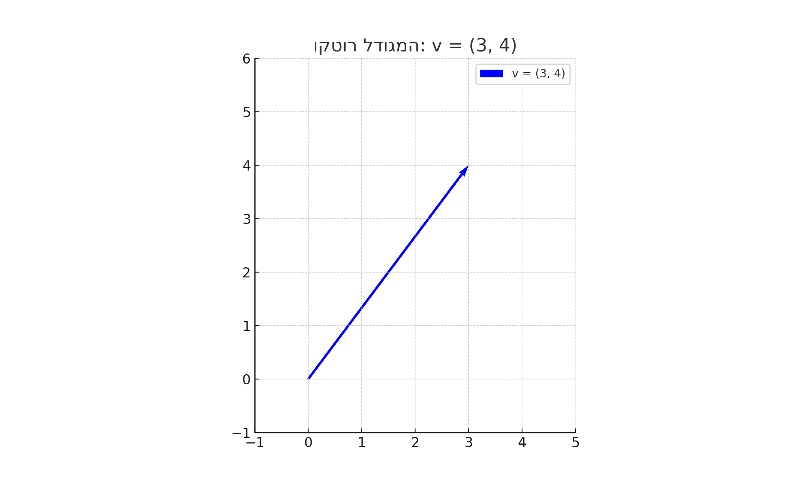
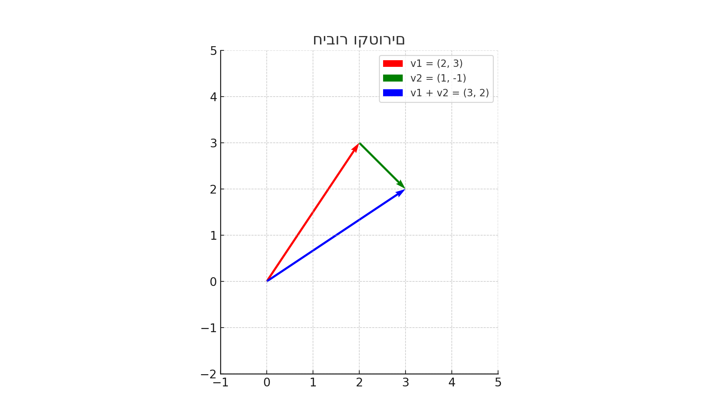

# וקטורים - הסבר מקיף ותכונות בסיסיות

## מהו וקטור?

וקטור הוא גודל מתמטי בעל שני מאפיינים: **גודל** (מגניטודה) ו**כיוון**. בניגוד לסקלר שהוא גודל מספרי בלבד (למשל: טמפרטורה, מסה), וקטור מייצג גם את הכיוון.

במערכת צירים דו-ממדית, וקטור מיוצג בדרך כלל כזוג סדור (x, y) שמייצג את הרכיבים של הוקטור בכיוון ציר ה-x וציר ה-y בהתאמה.

### דוגמאות לגדלים וקטוריים:
- מהירות (גודל + כיוון)
- כוח (גודל + כיוון)
- תאוצה (גודל + כיוון)
- שדה חשמלי (גודל + כיוון)

## ייצוג וקטורים

### ייצוג אלגברי
וקטור דו-ממדי: $\vec{{v}} = (v_x, v_y)$  
וקטור תלת-ממדי: $\vec{{v}} = (v_x, v_y, v_z)$

### ייצוג גרפי
וקטור מיוצג כחץ מ-(0,0) לנקודה (v_x, v_y)

## אורך (מגניטודה) של וקטור

- דו-ממדי: $|\vec{{v}}| = \sqrt{{v_x^2 + v_y^2}}$
- תלת-ממדי: $|\vec{{v}}| = \sqrt{{v_x^2 + v_y^2 + v_z^2}}$

## פעולות בסיסיות עם וקטורים

### 1. חיבור וקטורים

אם a = (a_x, a_y), b = (b_x, b_y), אז:  
a + b = (a_x + b_x, a_y + b_y)

#### המחשה גיאומטרית:
- מציבים את הוקטור השני כך שתחילתו בקצה של הראשון.
- סכום הוקטורים הוא חץ מראשית הצירים עד הקצה של השני.

### 2. הכפלה בסקלר

$c \vec{{v}} = (c v_x, c v_y)$

### 3. חיסור וקטורים

$\vec{{a}} - \vec{{b}} = (a_x - b_x, a_y - b_y)$

### 4. מכפלה סקלרית

$\vec{{a}} \cdot \vec{{b}} = a_x b_x + a_y b_y = |\vec{{a}}||\vec{{b}}| \cos\theta$

### 5. נירמול וקטור

$\hat{{v}} = \frac{{\vec{{v}}}}{{|\vec{{v}}|}}$

## שימושים

וקטורים נמצאים בשימוש ב:
- פיזיקה (כוחות, מהירויות)
- גרפיקה ממוחשבת
- רובוטיקה
- בינה מלאכותית
